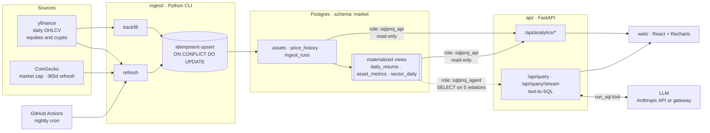

# tickerql

Daily OHLCV for 135 assets in Postgres: the 11 GICS sectors, seven Indian NSE
sectors and crypto. A FastAPI analytics layer sits on top, then a React
dashboard, and an agent you can ask questions in plain English.

The agent cannot write to the database. Postgres role grants enforce that, not
an instruction in the prompt.

The schema is still `market` and the database roles are still `sqlproj_*`.
Renaming them means a migration plus new credentials in four places, so the old
project name survives below the application layer.

## Architecture



Three roles at three privilege levels: `sqlproj_owner` writes, `sqlproj_api`
reads everything, `sqlproj_agent` reads five relations. The agent's pool
authenticates as the third one, so it cannot reach the write path even if every
check above it is bypassed.

## The security model

The requirement was that the SQL-generating agent only ever run against a
SELECT-only role, enforced in the database rather than in the prompt. Three
layers do that. The grants are the real enforcement. The other two exist so a
bug in one layer does not get as far as Postgres.

**1. Postgres grants**, in [`db/003_roles.sql`](db/003_roles.sql)

```sql
GRANT USAGE  ON SCHEMA market TO sqlproj_agent;
GRANT SELECT ON market.assets, market.price_history, market.daily_returns,
                market.asset_metrics, market.sector_daily
             TO sqlproj_agent;                        -- note: NOT ingest_runs

ALTER DEFAULT PRIVILEGES IN SCHEMA market REVOKE ALL ON TABLES FROM sqlproj_agent;

ALTER ROLE sqlproj_agent SET default_transaction_read_only = on;
ALTER ROLE sqlproj_agent SET statement_timeout = '5s';
ALTER ROLE sqlproj_agent CONNECTION LIMIT 5;
```

No `INSERT`, `UPDATE`, `DELETE` or `TRUNCATE` grant is ever issued to this role,
and `ALTER DEFAULT PRIVILEGES` means a table added next month does not quietly
become reachable. All of it runs as a plain owner role, since Neon does not hand
out superuser.

**2. AST validation**, in [`api/src/app/agent/guard.py`](api/src/app/agent/guard.py)

Every candidate statement goes through sqlglot before it reaches the database:
one statement only, root node must be a `SELECT` or set operation, every
resolved table in a five-name allowlist, a function denylist (`pg_sleep`,
`pg_read_file`, `dblink`, `lo_import`, …), and a `LIMIT` injected or clamped.

The guard walks every node rather than just the root. A data-modifying CTE like
`WITH x AS (DELETE FROM ... RETURNING *) SELECT * FROM x` has `Select` at the
root, so a root-only check would pass it.

**3. Execution context**

`SET TRANSACTION READ ONLY` before anything else, `SET LOCAL statement_timeout`,
a row cap, and a truncation flag on the response.

**The proof.**
[`api/tests/test_db_privileges.py`](api/tests/test_db_privileges.py) runs 33
tests that attempt `INSERT`, `UPDATE`, `DELETE`, `DROP`, `CREATE`, `TRUNCATE`
and `GRANT` as `sqlproj_agent` and check each one is refused. Every write is
retried with `SET default_transaction_read_only = off`, because the role can set
that flag itself. A suite that only tested with it on would be testing a session
default an attacker can turn off. With it off the writes still fail, which is
what shows the grants are doing the work.

Two limits worth naming. `statement_timeout` is role-overridable too, so the 5s
ceiling is a resource guard rather than a security guarantee; the row cap and the
read-only transaction are what bound the damage. And the agent can read every
row of the five relations it is granted. This is write protection and table
scoping, not row-level security.

## Quickstart

Needs Python 3.14, Node 20+, Docker and [`uv`](https://docs.astral.sh/uv/).

```bash
cp .env.example .env          # local defaults work as-is against docker compose

docker compose up -d db       # Postgres 17 on :5433

uv venv && uv pip install -r api/requirements.txt -r ingest/requirements.txt
uv pip install -e ./ingest -e ./api --no-deps

.venv/bin/python -m ingest probe             # check sources are reachable first
.venv/bin/python -m ingest migrate           # 001 → 002 → 003 → seed, in order
.venv/bin/python -m ingest backfill --years 3
.venv/bin/python -m ingest refresh-views
.venv/bin/python -m ingest coverage          # 752 bars/equity, 1096/crypto

.venv/bin/python -m pytest                   # 277 tests

.venv/bin/uvicorn app.main:app --reload      # :8000
cd web && npm install && npm run dev         # :5173
```

The frontend proxies `/api` to `127.0.0.1:8000` in dev, so CORS never comes up
locally. `/api/query` returns `503` with setup instructions until
`ANTHROPIC_API_KEY` is set; everything else works without it.

The agent can run against a gateway instead of api.anthropic.com. That is
configuration, not a code change. For OpenRouter:

```bash
ANTHROPIC_BASE_URL=https://openrouter.ai/api    # NOT .../api/v1
ANTHROPIC_AUTH_STYLE=bearer
ANTHROPIC_API_KEY=<your OpenRouter key>
ANTHROPIC_MODEL=anthropic/claude-opus-5
AGENT_EFFORT=                                   # blank omits output_config
```

The Anthropic SDK appends `/v1/messages` itself, so a trailing `/v1` double-paths
into a 405 and the config validator strips it. `output_config` is
Anthropic-specific and a gateway may reject it outright, which is what the blank
`AGENT_EFFORT` is for.

## What the data says

Generated from the live database by
[`scripts/insights.py`](scripts/insights.py), so a refresh that falsifies a
claim rewrites it rather than leaving a stale one in place.

```bash
.venv/bin/python scripts/insights.py --markdown
```

<!-- INSIGHTS:START -->

_Trailing 365 days ending 2026-08-27, from split- and dividend-adjusted closes. Risk-free rate assumed zero, so "return per unit of risk" is annualised return over annualised volatility._

### 1. More risk did not mean more return

Crypto ran 4.0x India: Consumer's volatility (57.2% vs 14.1%) and returned -52.7% against -1.1%: more risk and a worse outcome over the same window.

That is easy to dismiss as a crypto story, but the same thing shows up inside equities: India: IT carried 1.67x India: Consumer's volatility (23.7% vs 14.1%) to return -15.7%, less than India: Consumer's -1.1%.

| Sector | Return | Ann. vol | Return/risk |
|---|---:|---:|---:|
| Health Care | 38.2% | 17.6% | 2.19 |
| Energy | 51.4% | 24.6% | 2.11 |
| Industrials | 31.1% | 17.4% | 1.80 |
| Communication Services | -3.0% | 15.9% | -0.19 |
| India: IT | -15.7% | 23.7% | -0.67 |
| Crypto | -52.7% | 57.2% | -0.92 |

_Best and worst three of 19 sectors._

### 2. Crypto diversifies a stock portfolio, not itself

Average pairwise correlation *within* crypto is **0.72**, the highest of any sector, but India: IT is right behind at 0.67, so tight internal correlation is a property of narrow sectors rather than something peculiar to crypto.

The distinctive number is the other one. Crypto's average correlation to large-cap tech is **0.17**, against 0.34 within equity sectors. Adding a second crypto to a crypto book buys almost nothing; adding crypto to an equity book does.

### 3. Drawdown carries information volatility does not

ADA fell **-84.6%** peak to trough against ORCL's **-64.6%**, the worst equity. On its own that is unremarkable: 1.3x the drawdown on 1.2x the volatility is roughly what volatility already predicts.

Divide each asset's drawdown by its own volatility and the split tracks outcome more than asset class, though the two ranges overlap in this window. The **86** assets that finished the window positive sit at or below **1.11**; the **49** that finished negative sit at or above **0.67**. AMT is an equity that lost only -9.9% and still lands in the second group.

Volatility treats a 5% rise and a 5% fall as the same event, so it prices the size of the moves but not the order they arrive in. Drawdown is the order, and it is the loss someone actually has to sit through.

### 4. The best return and the best investment are different assets

AMD posted the highest return in the set at **185.3%**, but ranks 5th risk-adjusted, because it took 70.7% volatility to get there. **MPC** leads at 3.18 on 34.1% volatility, with a -18.3% maximum drawdown, the shallowest in the set.

| Asset | Sector | Return | Ann. vol | Return/risk | Max drawdown |
|---|---|---:|---:|---:|---:|
| MPC | Energy | 105.4% | 34.1% | 3.18 | -18.3% |
| MRK | Health Care | 90.1% | 30.0% | 2.97 | -11.4% |
| JNJ | Health Care | 56.6% | 18.8% | 2.97 | -11.0% |
| HDFCBANK | India: Financials | -23.6% | 20.7% | -1.20 | -27.5% |
| NKE | Consumer Discretionary | -49.1% | 36.9% | -1.34 | -49.1% |
| ITC | India: Consumer | -29.4% | 19.8% | -1.51 | -33.6% |

_Top and bottom three of 135. 50 assets finished the window with a negative ratio; the worst was ITC at -1.51._

<!-- INSIGHTS:END -->

## Data model

Schema is `market`, not `public`.

| Relation | Kind | Notes |
|---|---|---|
| `assets` | table | 135 rows across 19 sectors. `ticker` unique, `asset_type ∈ {stock, crypto}`, `source_symbol` maps `BTC` → `BTC-USD` and `RELIANCE` → `RELIANCE.NS`, `coingecko_id` for the mcap pass, `currency` `USD`/`INR` |
| `price_history` | table | PK `(asset_id, date)`. `close > 0` and `high >= low` enforced by CHECK |
| `ingest_runs` | table | Per-run audit. Deliberately not granted to the agent role |
| `daily_returns` | matview | Simple and log returns from `COALESCE(adj_close, close)` |
| `asset_metrics` | matview | Per `(asset_id, window_days ∈ {30, 90, 365})`: return, annualised return, annualised volatility, return/risk, max drawdown, avg volume |
| `sector_daily` | matview | Equal-weighted sector return plus a cumulative index rebased to 100 |

Every matview carries a `UNIQUE` index so `REFRESH MATERIALIZED VIEW
CONCURRENTLY` works. Without one the nightly refresh takes an `ACCESS
EXCLUSIVE` lock and stalls the API.

Four conventions that are easy to get wrong:

- **Money is `numeric`, statistics are `double precision`.** Exact storage,
  floating-point math. `exp()` and `power()` over `numeric` are slow and prone
  to overflow.
- **Returns come from `adj_close`, falling back to `close`.** Raw closes make
  splits look like crashes, and NVDA and AAPL both split inside this window.
- **Annualisation is 252 periods/year for equities, 365 for crypto.** One
  constant for both overstates equity volatility by roughly 20%.
- **Correlations intersect on common dates.** An equity/crypto pair is computed
  over the 251 shared trading days, not crypto's 365, so weekend crypto moves
  are not paired against nothing.

## API

| Method | Path | |
|---|---|---|
| `GET` | `/api/health` | liveness and data freshness; returns `degraded` with `stale_days` rather than a bare 200 |
| `GET` | `/api/assets` | universe with per-asset coverage |
| `GET` | `/api/prices/{ticker}` | OHLCV series, `start`/`end` optional |
| `GET` | `/api/analytics/sector-performance` | return, volatility, return/risk per sector |
| `GET` | `/api/analytics/sector-index` | equal-weighted cumulative index, rebased to 100 |
| `GET` | `/api/analytics/volatility` | volatility ranking |
| `GET` | `/api/analytics/correlation` | pairwise ticker matrix; 18,225 cells for 135 assets, so pass `tickers=` unless you want all of them |
| `GET` | `/api/analytics/correlation/sectors` | the 19x19 sector grid, averaged in SQL; 67 kB instead of 1.66 MB |
| `GET` | `/api/analytics/rolling-correlation` | one pair's correlation as a series, trailing window on every date |
| `GET` | `/api/analytics/periods` | best/worst days or months |
| `GET` | `/api/analytics/moving-averages/{ticker}` | 20/50/200-day, with an `is_partial` flag during ramp-up |
| `GET` | `/api/analytics/risk-return` | the scatter feed |
| `POST` | `/api/query` | natural language → SQL → answer |
| `POST` | `/api/query/stream` | the same answer as server-sent events, reported as the agent works |

Interactive docs at `/docs`.

Both query routes accept a bounded `history` of prior turns so follow-ups can
refer back. The bound is server-side, 12 turns and 12,000 characters, and it
trims rather than rejects. An unbounded transcript is a billing problem, not an
error anyone would see.

`/api/query` always returns the SQL behind the answer plus every rejected
candidate and why, so an answer can be audited against the query that produced
it:

```jsonc
{
  "answer": "Crypto had the highest volatility at 57.1% annualised …",
  "sql": "SELECT sector, annualized_volatility FROM …",
  "columns": ["sector", "annualized_volatility"],
  "rows": [["Crypto", 0.571], …],
  "attempts": [ { "sql": "…", "accepted": false, "rejection": "table not in allowlist: pg_stat_activity" } ],
  "model_calls": 2,
  "truncated": false
}
```

## Frontend

The binding constraint turned out to be colour, not data. The validated
categorical palette clears eight hues on the *adjacent* pairlist (lines, bars)
and only three on *all-pairs* (scatter, small multiples). With 19 sectors
neither is close, so past the cap `sectorColor()` returns `null` and the caller
has to fold or facet. It never wraps around and silently reuses a hue. That rule
shaped most of the views below.

| View | Form | Why |
|---|---|---|
| **Dashboard** | 19 sector small multiples, shared y-domain, one hue | No colour cap at all: identity is the panel label, comparison is the shared scale. A 19-line chart is unreadable at any palette size |
| **Risk vs return** | Scatter, two hues (equity/crypto), six labelled extremes | Labelling all 135 points printed one solid block of overlapping text. The six are computed from the data, so the set moves with the window |
| **Correlation** | 19×19 sector means, click a cell to drill into its assets | 135×135 is 18,225 cells and ~3,500 px tall. A sector cell is the mean of the pairwise correlations behind it, self-pairs excluded so intra-sector cells are not inflated by sector size |
| **Correlation over time** | One pair's trailing-window correlation on every date, under the matrix | A matrix cell is a mean. AAPL and BTC score 0.15 over three years, and their 60-day correlation runs from -0.19 to +0.51 across it. The dashed reference line is the matrix figure, so the gap is visible |
| **Ask** | Conversational transcript with live progress | Follow-ups refer back to earlier turns; every step is a real boundary in the agent loop, not a timer |

Five themes (Light, Dark, Midnight, Graphite, Sepia) on one axis and four
accents on another, so any pairing works. **Each theme has its own chart
palette, searched against its own surface.** It was one light set and one dark
set until the surfaces were measured, and the shared sets took a sub-3:1
contrast relief on three of the five, worst `#eda100` at 2.01:1 on Sepia. The
five sets now clear adjacent-CVD 11.6 to 13.7 against a target of 8.0, with no
relief anywhere.

They are generated rather than picked, by
[`web/scripts/build_palettes.mjs`](web/scripts/build_palettes.mjs). It solves
the slot ordering exactly, as a bottleneck Hamiltonian path over the pairwise ΔE
matrix, because the adjacent pairlist is what a line chart is measured on.
Chroma is aimed at a target rather than maximised: the first working version
maximised it and produced sets where every gate cleared and every line shouted.
No series may sit within 16° of the surface's own hue cast, because a blue line
on a blue ground reads as a tint of the ground, and that is the one failure a
contrast ratio cannot catch.

Two rules hold the colour system together. **Data owns the hues**, so the
validated categorical set is the only saturated thing on a page that carries
meaning. **Chrome wears ink**, so every series colour in every theme is OKLab
ΔE ≥ 15 from all four accents (Teal, Plum, Ochre, Oxblood) and a button can
never be mistaken for a line. That is a constraint inside the palette search,
not a check afterwards. The accent set that came before failed it at ΔE **0.0**,
because its blue was `#2a78d6`, which *was* categorical slot one.

The dataviz validator is vendored at
[`web/scripts/validate_palette.js`](web/scripts/validate_palette.js) rather than
pulled in as a dependency, so the check is reproducible from a clone.
[`web/scripts/check_palettes.mjs`](web/scripts/check_palettes.mjs) then
re-measures what actually shipped. It parses `palette.ts` and `styles.css`
rather than trusting the generator's own output, because the gap between a green
generator run and a correct app is the paste. It has a `--self-test` that
mutates a hex and expects the failure.

Three typefaces, because the product has three registers: Martian Mono for the
wordmark and every figure, Inter Tight for all prose, and IBM Plex Mono reserved
for SQL. The query face is deliberately not the display face. The seam between
the English question and the SQL it produced is the thing being shown, so the
query gets its own voice.

The validator only reads colour, so layout is checked by
[`web/scripts/screenshot.py`](web/scripts/screenshot.py), which shoots every view
in every theme at 1440px headless. Every layout defect found so far has been a
collision or an overflow no validator could have caught.

On the Ask page, `/api/query/stream` reports boundaries the agent loop already
passes through: model call started and finished, candidate SQL produced, guard
verdict, statement executing, rows returned. Only the elapsed clock is computed
in the browser, because a progress display that invents phases on a timer lies
exactly when the model is slow.

The generated SQL is always visible rather than folded into a disclosure widget,
and it is syntax-coloured from the *chart* palette, using three of the theme's
own series hues, so the app has one colour system and the query wears the same
hues as the chart it justifies. They are the same hues at text contrast, not the
same hexes: a mark needs 3:1 and text needs 4.5:1, and the values these replaced
were literal copies of the series colours that came out at 2.20:1 on Light. The
generator picks *which* three per theme, because some hues do not survive the
move. An olive at text lightness is acid whatever you do to it.

A 3px gutter beside the SQL carries the guard's verdict in `--good` or
`--critical`, which makes the security boundary a permanent property of every
answer instead of a notice that only appears when it fails.

Answers arrive as markdown and render through a small renderer in
[`web/src/components/Markdown.tsx`](web/src/components/Markdown.tsx) rather than
react-markdown plus remark-gfm, which is about 100 kB for six constructs. It
builds React elements and never touches `dangerouslySetInnerHTML`.

## Data sources

yfinance is the OHLCV backbone for equities *and* crypto history: 100 tickers ×
3 years in 5.1 seconds, measured rather than assumed. Requests are chunked 40 at
a time so one bad ticker fails its own chunk instead of the whole run. That is
not theoretical: `APD` failed transiently mid-backfill and succeeded on retry.

CoinGecko's keyless API caps historical data at 365 days (`error_code 10012`),
probed and confirmed. It cannot supply the 2 to 3 years of crypto history the brief
called for, so crypto history comes from the same provider as equities and
CoinGecko is kept for what it is actually best at: market capitalisation, the
trailing-365-day cross-check, and the daily refresh. This is a deliberate
deviation from the original spec, forced by their pricing tier.

Yahoo rate-limits plain `curl` from some networks but not yfinance, which uses
`curl_cffi` TLS impersonation, so swapping in raw HTTP would bring the block
back. `PriceSource` is a protocol with swappable implementations in
[`ingest/src/ingest/sources/`](ingest/src/ingest/sources/); Tiingo and
AlphaVantage are wired up as alternates.

One thing to know before touching the CoinGecko path: `/market_chart/range`
granularity depends on the range length. Two days or fewer returns 5-minute
data, 3 to 90 days returns hourly, 91 days and up returns daily. A 7-day refresh
returned 187 points, which would have upserted over each other and stored an
arbitrary intraday price as the daily close, corrupting every downstream figure
with no error at any layer. The probe caught it by printing an implausible bar
count. The fix is a `_last_per_date()` aggregation.

## Layout

```
db/       DDL applied in numeric order: 001 tables → 002 matviews → 003 roles → seed
          queries/  hand-written analytics SQL, loaded from disk at runtime so the
                    text the tests validate is the text the endpoints execute
ingest/   Python CLI. Fetches OHLCV, upserts idempotently, refreshes views.
api/      FastAPI. routers/ = analytics, agent/ = guard + prompt + runner.
web/      Vite + React + TypeScript + Recharts.
scripts/  insights.py, which regenerates the README's numbers from the database.
```

## Tests

```bash
.venv/bin/python -m pytest          # 277
cd web && npm test                  # 81
```

| File | | Covers |
|---|---:|---|
| `test_guard.py` | 54 | AST validation, including data-modifying CTEs |
| `test_api.py` | 50 | endpoint contracts, cache headers and error paths |
| `test_db_privileges.py` | 33 | the security boundary, adversarially |
| `test_gateway_config.py` | 28 | base-URL and auth-style handling for non-Anthropic gateways |
| `test_queries.py` | 31 | each analytics query against invariants: correlation symmetry, unit diagonal, moving-average ramp-up |
| `test_query_stream.py` | 19 | conversation-history bounds, SSE progress events, the streaming route |
| `test_agent.py` | 18 | the agent loop against a fake Anthropic client |
| `test_query_endpoint.py` | 16 | `/api/query` including the unconfigured 503 path |
| `test_ratelimit.py` | 16 | the sliding window, client identification, the disable path |
| `test_prompt.py` | 12 | prompt structure, cache markers, and that it describes the schema that exists |

The frontend's 81 run on `node --test` with no test framework, over the pure
parts: URL parsing, command ranking, and the two chart scales.

The query tests recompute results independently in Python and compare, rather
than asserting the shape of whatever the SQL happened to return. Several suites
are also mutation-tested: a deliberate break is introduced and the run has to
fail, since a passing test that cannot fail proves nothing.

## Performance

Three things were making the first load slow, measured against the deployed
instance rather than guessed at.

**The API sleeps.** It runs on Render's free plan, which suspends a service
after 15 minutes of no traffic and takes about 50 seconds to start the next
request. That wait lands on whoever opens the site first and no query tuning
touches it, because the request has not reached the application yet.
[`keep-warm.yml`](.github/workflows/keep-warm.yml) pings `/api/health` every 10
minutes. 24/7 uptime is roughly 730 instance hours a month against the plan's
750. This is a workaround for a plan limit, and the workflow can be deleted the
day the service moves onto a paid instance.

**The correlation page fetched 50x what it drew.** The sector grid is 361 cells
and the browser was building it by averaging the full 135x135 ticker matrix:
18,225 cells, 1.66 MB, about five seconds. That average now happens in SQL. The
response is 67 kB. Splitting the old five seconds locally: 2.2s was the
self-join, 0.02s was Pydantic, and the rest was encoding and shipping data the
page discarded. The ticker matrix is still the right shape for the drill-down,
where a `tickers=` subset covers two sectors rather than nineteen.

**Nothing was cacheable.** The data changes once a night, so analytics
responses now carry `Cache-Control: public, max-age=300,
stale-while-revalidate=86400` and moving between tabs stops re-fetching
everything. `/api/health` is excluded deliberately: its whole job is to report
how stale the data is, and a cached staleness reading is worse than none.

Compression was already on. Render's edge gzips responses, so the browser was
receiving 262 kB rather than 1.66 MB even before any of this, which is why the
fix had to be about generating and shipping less rather than squeezing it
harder.

## Deployment

Neon, then Render, then Vercel, then the nightly GitHub Action, in that order,
because each one needs a value the previous step produces. Every artifact is
committed ([`render.yaml`](render.yaml), [`api/Dockerfile`](api/Dockerfile),
[`web/vercel.json`](web/vercel.json),
[`.github/workflows/daily-refresh.yml`](.github/workflows/daily-refresh.yml));
the deploys themselves need accounts and are run by hand.

Two settings are easy to get wrong. Vercel's **Root Directory must be `web`**.
Without it the build starts at the repository root, finds `api/pyproject.toml`
and builds the FastAPI backend as a Python project. And `VITE_API_BASE` is
inlined at **build** time, so changing it after a deploy needs a rebuild to take
effect. Nothing secret belongs in a Vercel variable: this is a static build with
no serverless functions, so a `VITE_`-prefixed value is compiled into the public
bundle. Database credentials and the model API key live on Render.
