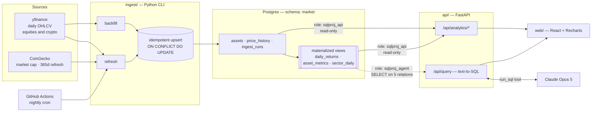

# Market Analytics Platform

Daily OHLCV for 16 assets across four equity sectors and crypto, landing in
Postgres, served by a FastAPI analytics layer, and queryable in plain English
by an LLM agent that **cannot write to the database** — a property enforced by
Postgres grants, not by prompt text.

React + Recharts dashboard on top. Three years of real market data, ingested
and verified locally.

---

## Architecture



Three Postgres roles at three privilege levels. `sqlproj_owner` writes,
`sqlproj_api` reads everything, `sqlproj_agent` reads five relations and
nothing else. The agent's pool authenticates as the third role and cannot
reach the write path even if every application-layer check is bypassed.

---

## The security model

The requirement was that the SQL-generation agent only ever run against a role
with SELECT-only permissions, enforced at the database level rather than in the
prompt. It is enforced in three layers, and **the first one is the real
enforcement** — the other two are defence in depth.

### Layer 1 — Postgres grants ([`db/003_roles.sql`](db/003_roles.sql))

```sql
GRANT USAGE  ON SCHEMA market TO sqlproj_agent;
GRANT SELECT ON market.assets, market.price_history, market.daily_returns,
                market.asset_metrics, market.sector_daily
             TO sqlproj_agent;                        -- note: NOT ingest_runs

ALTER DEFAULT PRIVILEGES IN SCHEMA market REVOKE ALL ON TABLES FROM sqlproj_agent;

ALTER ROLE sqlproj_agent SET default_transaction_read_only = on;
ALTER ROLE sqlproj_agent SET statement_timeout = '5s';
ALTER ROLE sqlproj_agent CONNECTION LIMIT 5;
```

No `INSERT`, `UPDATE`, `DELETE` or `TRUNCATE` grant is ever issued to this
role. `ALTER DEFAULT PRIVILEGES` means a table added next month does not
silently become reachable. All of it runs as a non-superuser owner, because
Neon does not hand out superuser.

### Layer 2 — AST validation ([`api/src/app/agent/guard.py`](api/src/app/agent/guard.py))

Every candidate statement is parsed with `sqlglot` before it reaches the
database: exactly one statement, root node must be a `SELECT`/set operation,
every resolved table in a five-name allowlist, a function denylist
(`pg_sleep`, `pg_read_file`, `dblink`, `lo_import`, …), and a `LIMIT` injected
or clamped.

The guard walks **every** node, not just the root, because a data-modifying CTE
(`WITH x AS (DELETE FROM … RETURNING *) SELECT * FROM x`) parses with `Select`
at the root and would pass a root-only check.

### Layer 3 — execution context

`SET TRANSACTION READ ONLY` issued before anything else, `SET LOCAL
statement_timeout`, a row cap, and a truncation flag on the response.

### The proof

[`api/tests/test_db_privileges.py`](api/tests/test_db_privileges.py) — 33 tests
that attempt `INSERT`, `UPDATE`, `DELETE`, `DROP`, `CREATE`, `TRUNCATE` and
`GRANT` as `sqlproj_agent` and assert each is refused.

The load-bearing detail: every write is retried with
`SET default_transaction_read_only = off`. That flag is settable by the role
itself, so a suite that only tested with it on would be testing a session
default an attacker can turn off. With it off the writes still fail, which
demonstrates the **grants** are what block them.

> **Two limitations, stated rather than hidden.** `statement_timeout` is also
> role-overridable, so the 5s ceiling is a resource guard and not a security
> guarantee — the row cap and read-only transaction are what bound damage.
> And the agent can still read every row of the five relations it is granted;
> the boundary is write-protection and table scope, not row-level access.

---

## Quickstart

Requires Python 3.14, Node 20+, Docker, and [`uv`](https://docs.astral.sh/uv/).

```bash
cp .env.example .env          # local defaults work as-is against docker compose

docker compose up -d db       # Postgres 17 on :5433

uv venv && uv pip install -r api/requirements.txt -r ingest/requirements.txt
uv pip install -e ./ingest -e ./api --no-deps

.venv/bin/python -m ingest probe             # check sources are reachable — run this first
.venv/bin/python -m ingest migrate           # 001 → 002 → 003 → seed, in order
.venv/bin/python -m ingest backfill --years 3
.venv/bin/python -m ingest refresh-views
.venv/bin/python -m ingest coverage          # 753 bars/equity, 1096/crypto

.venv/bin/python -m pytest                   # 175 tests

.venv/bin/uvicorn app.main:app --reload                       # :8000
cd web && npm install && npm run dev                         # :5173
```

The frontend proxies `/api` to `127.0.0.1:8000` in dev, so CORS never comes up
locally.

`/api/query` returns `503` with setup instructions until `ANTHROPIC_API_KEY` is
set. Everything else works without it — that is a supported state, not a broken
one.

---

## Business insights

Computed from the ingested data by [`scripts/insights.py`](scripts/insights.py),
not asserted in advance. Every comparison below is *selected* by the script —
it searches for the sector pair that best illustrates each claim — so a refresh
that falsifies a claim rewrites the prose instead of quietly leaving a lie.

```bash
.venv/bin/python scripts/insights.py --markdown
```

<!-- INSIGHTS:START -->

_All figures: trailing 365 calendar days ending 2026-08-20, computed from split- and dividend-adjusted closes. Risk-free rate assumed zero, so "return per unit of risk" is annualised return over annualised volatility._

### 1. Risk was not paid for — and the gap is visible inside equities, not just against crypto

**Crypto ran 2.9x Technology's volatility (57.1% vs 19.8%) and returned -44.7% against Technology's 34.0%** — more risk, and a worse outcome, over the same window.

That comparison is easy to dismiss as a crypto story. It is not. Among equity sectors alone, **Energy carried 1.21x Healthcare's volatility (24.9% vs 20.7%) to return 48.7% — less than Healthcare's 58.2%.** Ranked by return per unit of risk, the sectors order Healthcare (2.83), Energy (1.96), Technology (1.72), Financials (1.54), Crypto (-0.78).

### 2. Crypto diversifies a stock portfolio; it does not diversify itself

Average pairwise correlation *within* crypto is **0.88** — the highest of any sector. The tempting conclusion is that crypto is uniquely one position wearing three tickers. The data does not support that: Crypto 0.88, Energy 0.82, Financials 0.65, Healthcare 0.20, Technology 0.17. **Energy is nearly as tightly coupled**, so high internal correlation is a property of narrow sectors generally, not something peculiar to crypto.

What *is* distinctive is the other number. Crypto's average correlation to large-cap tech is **0.23**, against a within-sector equity average of 0.40. So the diversification benefit runs outward, not inward: adding a second crypto to a crypto book buys almost nothing, while adding crypto to an equity book genuinely does — the opposite of the common framing of crypto as levered tech beta.

### 3. Drawdown carries information volatility does not — and it is not about asset class

SOL fell **-74.9%** peak-to-trough against MSFT's **-34.5%**, the worst equity. Taken alone that says little: 2.2x the drawdown on 2.2x the volatility is roughly what volatility already predicts.

Divide each asset's drawdown by its own volatility and the picture separates cleanly — but not along the line you would expect:

- All **12** assets that finished the window positive sit at or below **0.88** drawdowns-per-unit-volatility (deepest: CVX).
- All **4** that finished negative sit at or above **1.03** (shallowest: ETH).
- The two groups do not overlap — the gap runs from 0.88 to 1.03.

The split is by *outcome*, not by asset type: MSFT is an equity that lost only -4.0% yet sits in the second group, deeper on this measure than 2 of the 3 crypto assets. Volatility is direction-blind by construction — it treats a 5% rise and a 5% fall as the same event — so it prices the size of the moves but not the order they arrive in. Drawdown is the order. For position sizing that difference is the whole game: it is the loss an investor actually has to sit through.

### 4. The best return and the best investment are different assets

LLY posted the highest return in the set at **77.8%** — but ranks 3rd on a risk-adjusted basis, because it took 35.7% volatility to get there. **JNJ** leads at 2.95 with 18.6% volatility and a -11.0% maximum drawdown — the shallowest in the set.

| Asset | Sector | Return | Ann. vol | Return/risk | Max drawdown |
|---|---|---:|---:|---:|---:|
| JNJ | Healthcare | 54.4% | 18.6% | 2.95 | -11.0% |
| XOM | Energy | 57.4% | 25.5% | 2.30 | -20.1% |
| LLY | Healthcare | 77.8% | 35.7% | 2.22 | -23.2% |
| ETH | Crypto | -44.8% | 65.7% | -0.70 | -67.6% |
| SOL | Crypto | -51.7% | 69.2% | -0.77 | -74.9% |
| BTC | Crypto | -35.4% | 43.9% | -0.83 | -53.1% |

_Top three and bottom three of 16. 4 assets finished the window with a negative ratio: MSFT, ETH, SOL, BTC — the last of which (BTC, -0.83) was the worst of the set._

<!-- INSIGHTS:END -->

---

## Data model

Schema is `market`, not `public`.

| Relation | Kind | Notes |
|---|---|---|
| `assets` | table | 16 rows. `ticker` unique, `asset_type ∈ {stock, crypto}`, `source_symbol` maps `BTC` → `BTC-USD`, `coingecko_id` for the mcap pass |
| `price_history` | table | PK `(asset_id, date)`. `close > 0` and `high >= low` enforced by CHECK |
| `ingest_runs` | table | Per-run audit. **Deliberately not granted to the agent role** |
| `daily_returns` | matview | Simple and log returns from `COALESCE(adj_close, close)` |
| `asset_metrics` | matview | Per `(asset_id, window_days ∈ {30, 90, 365})`: return, annualised return, annualised volatility, return/risk, max drawdown, avg volume |
| `sector_daily` | matview | Equal-weighted sector return plus a cumulative index rebased to 100 |

Every materialized view carries a `UNIQUE` index so
`REFRESH MATERIALIZED VIEW CONCURRENTLY` works — without one the nightly
refresh takes an `ACCESS EXCLUSIVE` lock and stalls the API.

### Conventions that matter

- **Money is `numeric`, statistics are `double precision`.** Exact storage,
  floating-point math. `exp()` and `power()` over `numeric` are both slow and
  prone to overflow.
- **Returns come from `adj_close`, falling back to `close`.** Raw closes make
  splits look like crashes — NVDA and AAPL both split inside this window.
- **Annualisation is 252 periods/year for equities, 365 for crypto.** Crypto
  trades every day; equities do not. A single constant for both overstates
  equity volatility by roughly 20%.
- **Correlations intersect on common dates.** An equity–crypto pair is computed
  over the 251 shared trading days, not crypto's 365 — otherwise weekend crypto
  moves would be silently paired against nothing.

---

## API

| Method | Path | |
|---|---|---|
| `GET` | `/api/health` | liveness **and** data freshness — returns `degraded` with `stale_days` rather than a bare 200 |
| `GET` | `/api/assets` | universe with per-asset coverage |
| `GET` | `/api/prices/{ticker}` | OHLCV series, `start`/`end` optional |
| `GET` | `/api/analytics/sector-performance` | return, volatility, return/risk per sector |
| `GET` | `/api/analytics/sector-index` | equal-weighted cumulative index, rebased to 100 |
| `GET` | `/api/analytics/volatility` | volatility ranking |
| `GET` | `/api/analytics/correlation` | pairwise matrix; 256 cells for 16 assets |
| `GET` | `/api/analytics/periods` | best/worst days or months |
| `GET` | `/api/analytics/moving-averages/{ticker}` | 20/50/200-day, with a `is_partial` flag during ramp-up |
| `GET` | `/api/analytics/risk-return` | the scatter feed |
| `POST` | `/api/query` | natural language → SQL → answer |

Interactive docs at `/docs`.

`POST /api/query` always returns the SQL that produced the answer, plus every
rejected candidate and why it was rejected, so an answer can be audited against
the query behind it:

```jsonc
{
  "answer": "Crypto had the highest volatility at 57.1% annualised …",
  "sql": "SELECT sector, annualized_volatility FROM …",
  "columns": ["sector", "annualized_volatility"],
  "rows": [["Crypto", 0.571], …],
  "attempts": [ { "sql": "…", "accepted": false, "rejection": "table not in allowlist: pg_stat_activity" } ],
  "model_calls": 2,
  "truncated": false
}
```

---

## Data sources

**yfinance is the OHLCV backbone for equities *and* crypto history.** Verified:
16 tickers × 3 years in about 10 seconds.

**CoinGecko's keyless API caps historical data at 365 days** (`error_code
10012`) — probed and confirmed, not assumed. It cannot supply the 2–3 years of
crypto history the brief called for, so crypto history comes from the same
provider as equities and CoinGecko is retained for what it is genuinely best
at: market capitalisation, the trailing-365-day cross-check, and the daily
refresh. **This is a deliberate deviation from the original specification,
forced by their pricing tier.**

Yahoo rate-limits plain `curl` from some networks but not `yfinance`, which
uses `curl_cffi` TLS impersonation. Swapping in raw HTTP would reintroduce the
block. `PriceSource` is a protocol with swappable implementations
([`ingest/src/ingest/sources/`](ingest/src/ingest/sources/)) — Tiingo and
AlphaVantage are wired up as alternates if a source is ever blocked.

### One near-miss worth knowing about

CoinGecko's `/market_chart/range` granularity is **range-dependent**: ≤ 2 days
returns 5-minute data, 3–90 days hourly, 91+ days daily. A 7-day refresh
returned 187 points, which would have upserted over each other and stored an
arbitrary intraday price as the daily close — corrupting every downstream
figure with no error at any layer. It was caught because the probe printed an
implausible bar count. The fix is a `_last_per_date()` aggregation. Logged as
M-11 in [`docs/DECISIONS.md`](docs/DECISIONS.md).

---

## Layout

```
db/       DDL applied in numeric order: 001 tables → 002 matviews → 003 roles → seed
          queries/  hand-written analytics SQL, loaded from disk at runtime so the
                    text the tests validate is the text the endpoints execute
ingest/   Python CLI. Fetches OHLCV, upserts idempotently, refreshes views.
api/      FastAPI. routers/ = analytics, agent/ = guard + prompt + runner.
web/      Vite + React + TypeScript + Recharts.
scripts/  insights.py — regenerates the README's numbers from the database.
docs/     DECISIONS.md (every decision and every mistake), DEPLOY.md (runbook).
```

## Tests

```bash
.venv/bin/python -m pytest          # 175
```

| File | | Covers |
|---|---:|---|
| `test_db_privileges.py` | 33 | the security boundary, adversarially |
| `test_guard.py` | 54 | AST validation, including data-modifying CTEs |
| `test_api.py` | 35 | endpoint contracts and error paths |
| `test_queries.py` | 22 | each analytics query against invariants — correlation symmetry, unit diagonal, moving-average ramp-up |
| `test_agent.py` | 13 | the agent loop against a fake Anthropic client |
| `test_query_endpoint.py` | 10 | `/api/query` including the unconfigured 503 path |
| `test_prompt.py` | 8 | schema/few-shot prompt structure and cache markers |

The query tests recompute results independently in Python and compare, rather
than asserting the shape of whatever the SQL happened to return.

## Deployment

See [`docs/DEPLOY.md`](docs/DEPLOY.md) for the ordered runbook: Neon → Render →
Vercel → GitHub Actions. Artifacts are committed
([`render.yaml`](render.yaml), [`api/Dockerfile`](api/Dockerfile),
[`web/vercel.json`](web/vercel.json),
[`.github/workflows/daily-refresh.yml`](.github/workflows/daily-refresh.yml));
the deploys themselves need accounts and are run by hand.

## Decisions and mistakes

[`docs/DECISIONS.md`](docs/DECISIONS.md) records every non-obvious design
decision and every mistake made building this, with reasoning and what each one
cost. It is kept because the mistakes are the more useful half — several of
them were green-passing tests that verified less than they appeared to.
